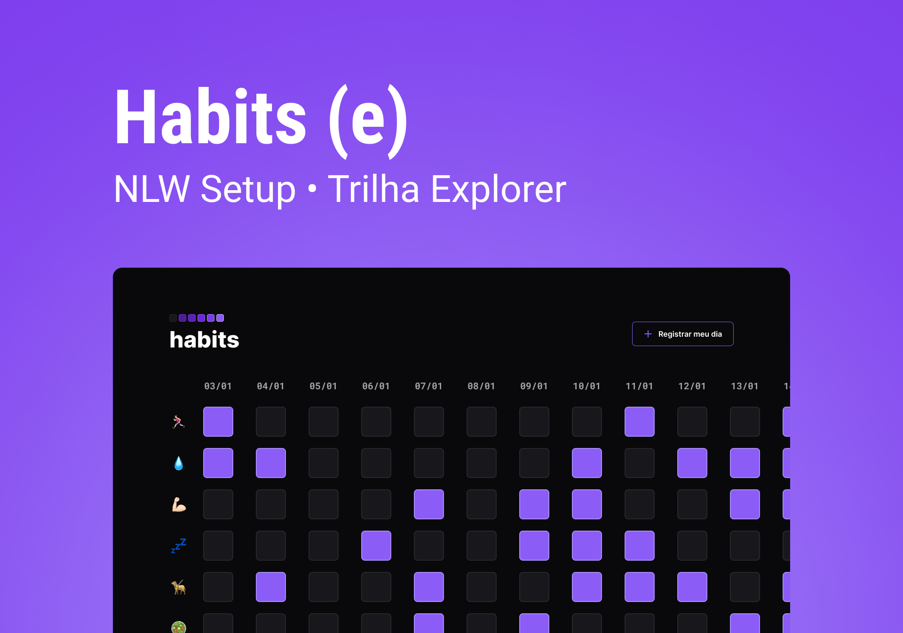

<h1 align="center"> Habits </h1>

Esse projeto foi desenvolvido durante  o NLW Setup na Rocktseat.

 

  

## 🚀 Tecnologias

Esse projeto foi desenvolvido com as seguintes tecnologias:

- HTML e CSS
- JavaScript
- Git e Github

## 💻 Projeto

O Habits é um app para ajudar a rastrear os hábitos.

- [Visite o projeto online](https://geanalef.github.io/nlw-setup)
